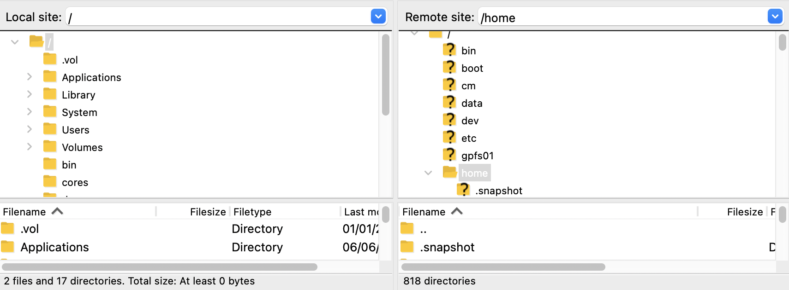

# Running jobs on the Hydra scheduler

Objectives:
* Learn how to connect to Hydra remotely.
* Learn how to find programs installed on the cluster.
* Learn how to create and submit a job to the HPC scheduler.
* Learn how to transfer results to your local computer.

## Logging In

### Usernames
For Smithsonian users your Hydra username is the same as your SI username (the portion of your email address before `@si.edu`), all in lowercase. For SAO users, your username is typically your first initial then your last name.

| When you see `{user}` in this tutorial, replace that with your Hydra username!|
|---|

### Password
Your Hydra password is independent of your Smithsonian network password.

*See the Password Reset section below if you need to reset your password.*

### telework.si.edu

The [telework.si.edu](https://telework.si.edu) system allows any user with a Smithsonian user account to remotely connect to Hydra.  It's available from inside the Smithsonian network as well as remotely. There is a web-based terminal program to access Hydra.

After logging in, expand the "IT Tools" section and choose "Hydra".


Click on one of the "SSH terminal" links to start the web terminal connection to one of the login nodes.


At the `login:` prompt, enter your Hydra username and at the `password:` prompt, enter your Hydra password.

### Direct `ssh` connections

When possible, a direct ssh connection from your workstation to Hydra is preferred to using the web-based Telework interface. You'll need to be using a computer located on the Smithsonian network or a remote computer with a VPN connection.

- SI users seeking to request a VPN can do so with [this form](https://smithsonianprod.servicenowservices.com/si/?id=sc_cat_item&sys_id=cd8bcf38dbaec810faac7c031f961992).
- CfA users should consult with their HPC support staff on how to establish this connection.

#### `ssh` for Windows

For Windows users, we recommend using the ssh client that is built in to the Command prompt of recent Windows 10 versions. (The free program, [PuTTY](https://www.chiark.greenend.org.uk/~sgtatham/putty/latest.html), is an alternative option).

Open the command prompt from the Start menu (type "command" or "cmd" in the search bar).

In the command prompt window start the hydra connection with: `ssh {user}@hydra-login01.si.edu`. If you get an alert about the authenticity of the host, type `yes`. Enter your Hydra password at the `Password:` prompt.

### `ssh` for Mac

If you are on a Mac, open the Terminal program which can be found in the Utilities folder inside the Applications folder (or type "terminal" in the popup Spotlight search).


Login with your Hydra username and password:
```
$ ssh {user}@hydra-login01.si.edu
```

### Resetting your password

Hydra has a self-service password reset system that you use to set your initial password and other times you need to reset your password (e.g. forgotten or expired password).

There is a link to this page on the page that lists Hydra's web-based tools.
- Telework: go to the Hydra option in "IT Tools" on the Telework site and choose "Password Self Help"
- On-site/VPN: go to https://hydra-adm01.si.edu/

There are two pages in the Self Help system. The initial one is to change your password (password changes are required every 180 days).

To create a new password choose "Request an email with a password reset link"


Enter your Hydra **user name** (not email) in the "Login" box and then press Send


A reset link will be emailed to your institutional email account.

## Creating a project directory

Now that we are successfully logged in, you will see a little blurb about recent Hydra news. Make sure you read this.

You will also see a prompt that looks something like this:

```
[{user}@hydra-login01 ~]$ _
```

Your `/home` directory has a relatively small size limit, so you don't store data here. There are several disks to run analyses from, we'll be using `/scratch`.

There are subdirectories for different groups. Biologists use `/share/genomics`, NASM use `/share/nasm`, SAO use `/share/sao`

See https://confluence.si.edu/display/HPC/Disk+Space+and+Disk+Usage for more information about the storage configuration.

```
$ cd /scratch/genomics/{user}
```

```
$ cd /scratch/nasm/{user}
```

```
$ cd /scratch/sao/{user}
```

| Let us know if you get an error and we'll help you find or create your `/scratch` directory |
|---|


Now that we're in the correct location, it is best practice to create a separate directory for each "project" you are working on. You can make a new directory with the `mkdir` command.

```
$ mkdir hydra_workshop
```

And now enter the new project directory by using the `cd` command again.

```
$ cd hydra_workshop
```

## Modules

System-wide software installations on Hydra are packaged in the form of *modules*.

Modules are a way to set your system paths and environmental variables for use of a particular program or pipeline.

| If you would like to install your own software on Hydra, you can compile code from source or use a management system like Conda. Check out the [Conda tutorial](https://confluence.si.edu/display/HPC/Conda+tutorial) on the Hydra wiki for more info. |
| --- |

You can view available modules with the command:

```
$ module avail
```

This will output all modules installed on Hydra.

This is also listed on a website: https://www.cfa.harvard.edu/~sylvain/hydra/module-avail.html

You can list all versions of a module with this (Note: tab-completion works for module name):

```
$ module avail bioinformatics/iqtree
```

You can see module-specific help for any module with the `module help` command. These are written as part of the Hydra installation process, and should not be mistaken for the official documentation for the software.

```
$ module help bioinformatics/iqtree

-------------------------------------------------------------------
Module Specific Help for /share/apps/modulefiles/bioinformatics/iqtree/2.1.3:


Purpose
-------
This module file defines the system paths for IQTREE 2.1.3
The compiled binary that you can now call is:
iqtree2

Documentation
-------------
http://www.cibiv.at/software/iqtree/

<- Last updated: Tue Nov 30 09:41:39 EST 2021 ->

-------------------------------------------------------------------
```

Ok, now let's actually load IQ-TREE.

```
$ module load bioinformatics/iqtree
```

You should get a notification that the module was loaded along with another required module, but nothing else has changed.

We'll run a quick command to show that we have IQ-TREE loaded properly.

```
$ iqtree2
IQ-TREE multicore version 2.1.3 COVID-edition for Linux 64-bit built Apr 21 2021
Developed by Bui Quang Minh, James Barbetti, Nguyen Lam Tung,
Olga Chernomor, Heiko Schmidt, Dominik Schrempf, Michael Woodhams.
...
```

|*In this exercise we loaded a module on the login node, but to run an analysis, we need to submit a job to the cluster*|
|---|

## Submitting a job

We're going to create an [IQ-TREE](http://www.iqtree.org/) (a phylogenetics application) job file to submit to be run on one of the compute nodes.

### Transferring files

Critical to using Hydra is being able to transfer files to and from the system. You'll typically need to transfer to Hydra your input files and then copy back output for backing up and reporting.

In this workshop we'll be running IQ-TREE on this [sequence alignment](https://doi.org/10.17632/ty5h3y9rwx.1) from [Wood et al.’s 2018 spider UCE paper](https://doi.org/10.1016/j.ympev.2018.06.038) generated at NMNH.

Go to the [sequence alignment](https://doi.org/10.17632/ty5h3y9rwx.1) page and download "Exon_50per_taxa.phylip.txt" to your workstation.

The best way to transfer files depends on your connection to Hydra. A full description of file transfer options is available here: https://confluence.si.edu/display/HPC/Disk+Space+and+Disk+Usage#DiskSpaceandDiskUsage-HowToCopy

- Telework: ffsend uses a free cloud file transfer service and [accompanying script](https://github.com/timvisee/ffsend) to move files. It works well for a small number of moderately sized files. On your workstation you can use the script or a website to upload files to the service and on Hydra you use the module `tools/ffsend` to download or upload files.
- Windows or Mac directly connected to the Smithsonian network
  - The `scp` command is a great utility for transferring files to and from Hydra.
  - For a GUI program we recommend FileZilla, which you can download from [https://filezilla-project.org/download.php?show_all=1](https://filezilla-project.org/download.php?show_all=1)

#### FileZilla (direct connection to Hydra)

Using FileZilla is a convenient GUI based file transfer program that will work on computers running on the SI network or on a computer connected via VPN.

If your computer doesn't have FileZilla installed, download it [https://filezilla-project.org/download.php?show_all=1](https://filezilla-project.org/download.php?show_all=1)

Hint: you can run the program even if you don't have admin rights to the computer. You can run the Mac version without transferring to the Applications folder. On Windows, download and extract the version that ends with `.zip` instead of `setup.exe` (the `64bit x86` version will work on most Windows systems.)

To setup FileZilla to connect to Hydra, enter these settings in the top bar:
- Host: hydra-login02
- Username: Your Hydra username
- Password: Your Hydra pasword
- Port: `22` (this defines the type of transfer protocol being used, scp/sftp in this case)

Then press the `Quickconnect` button.


On your first login, you'll be prompted about an "Unknown host key." Check "Always trust this host, add this key to the cache" and click "OK"


The FileZilla user interface is setup that the local system (your workstation) is listed on the left and the remote system (Hydra) is listed on the right. You navigate to the local directory on the left side and the remote on the right and then transfer files by double-clicking or dragging.



Use this method to transfer `Exon_50per_taxa.phylip.txt` to your /scratch/genomics/{user}/hydra_workshop directory

#### ffsend (Telework connection to Hydra)

To transfer files to Hydra, we're going to show you how to use ffsend, which uploads your files to a cloud service and returns a URL you can download the file from on Hydra.

Open the https://send.vis.ee website and upload your file.
Copy the link with the "Copy link" button.

Next, we'll load the ffsend module and then download the file by pasting `ffdownload` and the copied url.

Note for users of the telework interface on Windows: to paste the URL you have to right click on the Hydra web page to get a pop-up menu. Choose "Paste from browser" and the use control-v to paste the ffsend url into the pop-up window at the top of the page and then press OK.

```
$ module load tools/ffsend
$ ffdownload https://send.vis.ee/download/id/#id
```

Confirm the file has transferred by using the `less` command

```
$ less Exon_50per_taxa.phylip.txt
```

Next we'll rename this downloaded file. This isn't strictly necessary, but it will allow us use the standard file extension for Phylip files (`.phy`) and we'll get to use the `mv` command.

```
$ mv Exon_50per_taxa.phylip.txt exon_50per_taxa.phy
$ ls
```

*Best practice: use tab completion to automatically extend a directory or file name without manually typing the whole name, this also avoids typos.*

### Creation of job submission file

Now that the input file is in place, we'll need to generate a job submission file.

We will be using the Hydra QSub Generation Utility to create this file.

There is a link to this page on the page that lists Hydra's web-based tools.
- Telework: open the Hydra option in "IT Tools" on the Telework site
- On-site/VPN: go to https://hydra-adm01.si.edu/

* *CPU time*: short
* *Memory*: 4 GB
* *Type of PE*: multi-thread
* *Number of CPUs*: 4
* *Select the job's shell*: sh
* *Select which modules to add*: bioinformatics/iqtree
* *Job specific commands*:

```
iqtree2 -s exon_50per_taxa.phy \
       -nt $NSLOTS \
       -pre exon_50per_taxa
```

* *Job Name*: iqtree
* *Log File Name*: iqtree.log
* *Err File Name*: [blank]
* *Change to CWD*: Y
* *Join output & error files*: Y
* *Send email notifications*: Y
* *Email*: [your email]

This will generate the contents of your "job file" at the bottom. Click on the "Check if OK" button for any errors and then "Save it" to save to your computer.

By default, the QSub Generator site will export this job file with a filename of "qsub.job", but it can be easy to lose track of several different versions of the same name ("Did I set up that analysis in qsub.job(54) or qsub.job(27)?"). Let's use the same job name from our job script, and rename the file to "iqtree.job".

Now we need to transfer this job file to on Hydra using FileZilla or ffsend (https://send.vis.ee).

The file should go in to your `/scratch/genomics/{user}/hydra_workshop/` directory.

Confirm the file looks ok by using `cat`

```
$ cat iqtree.job
```

#### Editing text files on Hydra

A common need is to make edits to a text file that resides on Hydra. There are several command-line based text editors you can use. Popular ones are `vi`, `emacs`, and `nano`. We'll use `nano` which is commonly considered the best choice for beginners.

Let's edit the job file to specify which version of IQ-TREE to use. Currently the module used is `bioinformatics/iqtree`. Since the version is not specified, the default version will be used, which may not be what you want.

You can view the available versions of iqtree with `module avail bioinformatics/iqtree`

Let's specify `bioinformatics/iqtree/2.1.3` which is currently the default, but that may change in future software updates to Hydra.

Edit the job file with: `nano iqtree.job`

Add `/2.1.3` to the end of the line with `module load...`

Use the arrow keys (sorry, the mouse doesn't work with the command line) to move the cursor and then add the additional text.

The line should now look like this:

```
module load bioinformatics/iqtree/2.1.3
```

To save the changes, use `control+o` for "WriteOut" which is the nano way of saying "Save."

When prompted for the file name, keep it `iqtree.job`

```
File Name to Write: iqtree.job
```

Now you can close the editor with `control+x`

### Submitting your job

You're now ready to submit your job to the compute nodes, using the `qsub` command. ("q", short for "queue" and "sub" for "submit")

```
$ qsub iqtree.job
```

## Monitoring your job

This IQ-TREE analysis will take a few minutes to complete.

You can use `qstat` ("stat" for "status") to check on your cluster jobs.

```
$ qstat
```

If nothing appears here, then your job is finished, but you can't tell yet if it was successful or failed.

**Hint: if your job disappears from the `qstat` list in a few seconds it likely means it failed.**

**If your job finishes without producing the expected output files, your first instinct should be to check the log file.**

You can view your log file while the job is running or after it completes:

```
$ more iqtree.log
```

*Use the space bar to page through the file.*

Note the job id that is listed in here on one of the first lines

```
+ Thu May 20 13:38:30 EDT 2021 job iqtree started in sThC.q with jobID=21884560
```

When the job is running you can get more information about the job with the `qstat` command using the `-j` argument:

```
qstat -j 21884560
```

When the job is complete, you can get a report on the completed job using the `qacct` or the Hydra-specific tool `qacct+` which uses the same information as `qacct`, but has more configurable output, it's very useful for troubleshooting when memory limits are hit.

```
$ qacct+ -j 21884560
```

*Pay specific attention to the maxvmem line of the output. This shows the maximum amount of virtual memory that your job used. If this is significantly less than the amount you requested, make sure to adjust in future jobs.*

To transfer the resulting treefile to your personal computer using ffsend use this command:

```
ffsend upload exon_50per_taxa.treefile
```

If you want to view the treefile, download it using the ffsend url and then go to [https://icytree.org/](https://icytree.org/) in a web browser, and open up the ".treefile" file to view the tree.

## Interactive queue

Hydra has another way of running jobs on the compute nodes, without using the job scheduler. Let's try to run the exact same iqtree command using this technique.

First, you need to use the `qrsh` command to enter this environment. The main parameter to know is how many threads you will be using.

```
$ qrsh -pe mthread 2
```

An important point to note with the interactive queue is that is always places you back in your `/home` directory, which can be confusing.

```
$ pwd
/home/{user}
```

So let's go back to our "hydra_workshop" directory.

```
$ cd /scratch/genomics/{user}/hydra_workshop
```

And now we can directly run the same commands that we listed out in our job file.

```
$ module load bioinformatics/iqtree
```

And then the same iqtree command -- but changing the data paths, since we're in the main project directory now.

```
$ iqtree2 -s exon_50per_taxa.phy -m GTR+F+R4 -nt $NSLOTS -pre exon_50per_taxa -redo
```

When you're done with the interactive job, use `exit` to return to the login node.

```
$ exit
```

## Next steps

### File organization

It's best practice to create an organizational structure so that we can come back in a few weeks and remember what we did. This structure is a good start, but feel free change based on your needs as you gain experience.

We're going to create multiple directories in one command by listing them all. The `-p` option for `mkdir` is really useful, it creates the parent directory if it doesn't already exist. This automatically creates the `data` directory when we say we want `data/raw` and `data/results` created.

```
$ mkdir -p jobs logs data/raw data/results
```

Now that our scaffold is built, you can visualize it with the `tree` command.

```
$ tree
.
├── data
│   ├── raw
│   └── results
├── jobs
└── logs

5 directories, 0 files
```
